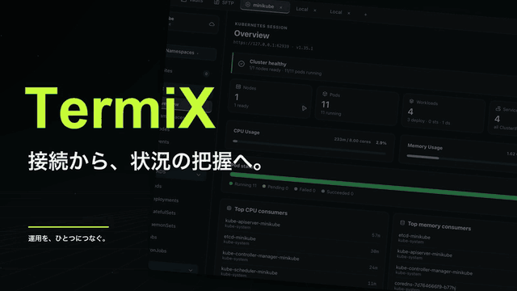

# TermiX

[English](README.md) · [繁體中文](README.zh-Hant.md) · [日本語](README.ja.md)

TermiX は **SSH、ターミナル、SFTP、Kubernetes、AI による障害分析**をひとつの運用ワークスペースにまとめます。独立したモバイルアプリで、スマートフォンからもホスト接続やクラスター操作を行えます。

## 対応プラットフォームと端末

| プラットフォーム | 提供状況 |
| --- | --- |
| macOS | デスクトップ版。メニューバーの接続状況表示と、対応版での更新機能。 |
| Windows・Linux | デスクトップ版。配布パッケージは Releases を参照。 |
| iOS | SSH、Kubernetes、ホスト設定の読み込みに対応したプレビュー版。 |
| Android | サポート対象の正式版は未提供。 |

## デスクトップ版の機能

### ホストとクラウドリソース

- **Host Vault**：ホスト、フォルダー、グループを管理。検索、お気に入り、ドラッグによる整理、設定のインポート／エクスポートに対応。
- **SSH 認証**：パスワード、秘密鍵、パスフレーズ、SSH 証明書に対応。初回接続でホスト鍵を確認し、不一致の鍵を自動的に信頼しません。
- **クラウドホストの取り込み**：AWS EC2／Lightsail と GCP Compute Engine VM に対応。設定は [GCP ガイド](docs/GCP-INTEGRATION.md)を参照。
- **モバイル設定同期**：一般的なホスト設定をファイルで書き出し、または条件を満たす Apple 向けビルドで CloudKit を使用。パスワード、秘密鍵、kubeconfig は対象外。

### ターミナル、スニペット、コントロールパネル

- **ターミナル**：リモート SSH とローカルターミナル、複数タブ、分割ペイン、自動サイズ調整、対話型 TUI。
- **タブの整理**：タブをドラッグして分割ペインに結合。右クリックメニューまたはセッション名のダブルクリックで名前を変更し、Enter で保存、Esc でキャンセル。
- **スニペット**：コマンドを保存し、ターミナルに貼り付け、または実行。ホスト起動時のコマンドや、指定ホストへの一括実行にも対応。
- **コントロールパネル**：FunctionBox で操作を実行し、InfoBox で状態を表示。FunctionBox のローカルコマンドは既定で `open` のみ許可。
- **ログ**：セッション、コントロールパネル、Kubernetes コンテナのログ。
- **個人設定**：繁体字中国語、英語、日本語、テーマ、ターミナルの文字サイズ、ローカル Shell パス、キーボードショートカット。

### SFTP ファイル転送

- ローカル／リモートの 2 ペイン表示、パス入力、親フォルダーへの移動、再読み込み、ホスト検索、最近の接続順での表示。
- ファイルとフォルダーのアップロード／ダウンロード、複数選択、ドラッグによるアップロード、フォルダー作成、名前変更、空フォルダーの削除。
- バックグラウンドの転送キューに進捗、平均速度、成功／失敗を表示。タブを切り替えても転送は継続。
- 同名の転送先を上書きせず、転送の再開やアプリ再起動後の復元は非対応。詳細は [SFTP ガイド](docs/SFTP.md)を参照。

### Kubernetes ワークスペース

| 機能 | 内容 |
| --- | --- |
| 接続と切り替え | kubeconfig の読み込み、クラスター接続の管理、Context／Namespace の切り替え、kubeconfig パスの指定。 |
| 概要と使用量 | Overview、Node の CPU／メモリ使用率、Pod 使用量。Metrics や権限がない場合はゼロではなく取得不可として表示。 |
| リソース | Nodes、Pods、Deployments、StatefulSets、Workloads、Networking、Storage などの分類、検索、詳細 Drawer。 |
| 状態とイベント | Pod 状態フィルター、異常表示、関連イベント。All／Warning／Normal のイベントフィルターと件数を検索条件と併用可能。 |
| ログと Shell | コンテナの選択、ログの絞り込み、一時停止、ダウンロード、クリア、Pod Shell。 |
| リソース操作 | YAML 表示、対応リソースの編集・作成、単一／複数削除、Deployment／StatefulSet のレプリカ数変更。マスク済みの Pod／Secret YAML は直接編集・適用不可。 |
| ポート転送 | Pod／Service の Port Forward の開始、確認、停止。 |

参照と変更には、接続中のクラスターの Kubernetes RBAC 権限が必要です。リソースの状態や Metrics の値は、外部からのサービス利用可否を保証しません。

### Pod・Event の AI 分析

- **Agent 接続**：Settings → AI Connection でローカルの Codex、Claude Code、Gemini CLI を検出、接続、テスト。モデル一覧は Agent から取得。
- **Pod 分析**：コンテナと Events／Logs の範囲を選択し、結論、根本原因の分析、対処案を表示。実際に送信した根拠も確認可能。
- **Event 分析**：Event Drawer からイベントと関連リソースの現在の状態を分析。ログ、Secret、完全な YAML は読み込まない。
- **追加質問**：元の分析を保持したまま、新しいリソースのスナップショットを添えて質問。処理はキャンセル可能で、結果と会話は現在のクラスター接続中に一時保存。
- **保存期間**：再分析でそのリソースの以前の結果を削除。クラスターからの退出・切り替え、アプリ終了時に一時保存を消去。

事前に Agent CLI をインストールしてログインしてください。Codex と Claude Code には ACP アダプターも必要です。AI は診断テキストのみを返し、修復を自動実行しません。選択したログとイベントは Agent に送信され、モデルサービスがリモートで動作する場合があります。アプリがログに出力した機密情報も選択データに含まれます。Gemini は試験的な対応で、一部のアカウントでは利用できません。導入手順と分析に使用するデータの説明は [AI ガイド](docs/pod-ai-analysis.md)を参照してください。

### macOS 連携

メニューバーで SSH 接続数と実行中の Port Forward 数を表示します。ホスト、クラスター、ポートの確認、接続の切断、転送の停止、メイン画面への復帰が可能です。Sparkle 対応版では更新確認と自動ダウンロードを設定でき、再起動前に使用中の接続と転送を確認します。

## ACP のインストールと AI 分析の有効化

ACP は TermiX と Agent CLI の通信に使用するプロトコルです。**Codex または Claude Code 本体のインストールだけでは不十分で、対応する ACP アダプターも必要です。** TermiX はアダプターを自動でダウンロード・インストールしません。

1. Node.js と npm を用意し、使用する Agent CLI をインストールします。その CLI の通常の手順でログインし、必要なモデルを利用できることを確認してください。
2. 使用する Agent のアダプターをインストールします。すべてを入れる必要はありません。

   | Agent | インストール | TermiX が検出する実行ファイル |
   | --- | --- | --- |
   | Codex | `npm install -g @agentclientprotocol/codex-acp` | `codex-acp` |
   | Claude Code | `npm install -g @agentclientprotocol/claude-agent-acp` | `claude-agent-acp` |
   | Gemini CLI | 既存の Gemini CLI を使用。追加の ACP パッケージは不要 | `gemini`。TermiX が `--acp` を付けて起動 |

3. npm でグローバルにインストールした実行ファイルに、現在のユーザーからアクセスできることを確認します。インストール後に TermiX を開き直し、**Settings → AI Connection** で実行ファイルの場所と状態を確認します。
4. Agent を接続し、接続テストを実行します。テストでは接続とモデル一覧の取得を確認し、分析は実行しません。アダプターが見つからない場合はインストールと実行ファイルの検出を確認し、ログインや権限のエラーは CLI 側で解消してください。
5. **Kubernetes → Pods／Events → リソース Drawer → AI Analysis** を開き、接続済み Agent と取得した一覧のモデルを選択します。Pod ではコンテナと Events／Logs の範囲も指定して分析を開始します。完了後、同じパネルで追加質問ができます。

ターミナルで ACP プロセスを手動起動したままにする必要はありません。セッションは TermiX が管理します。接続テストの成功は、すべてのモデルの推論権限や利用枠を保証しません。分析には選択した Agent のモデルサービスを使用します。Gemini は試験的な対応です。データ範囲と互換性は [AI ガイド](docs/pod-ai-analysis.md)を参照してください。

## モバイル版とデバイス連携

モバイル版では以下の機能を利用できます。

| 機能 | 現在のモバイル版の内容 |
| --- | --- |
| ホスト管理 | ホストとフォルダー、パスワード／秘密鍵認証、端末の安全なストレージでの認証情報保存。 |
| SSH ターミナル | 実際の SSH／PTY、ホスト指紋確認、ショートカット、保存コマンド、タッチ操作、機密入力。一度に 1 セッションで、バックグラウンド移行時に切断。 |
| Kubernetes | kubeconfig の取り込み、クラスターと Namespace の切り替え、リソース分類、状態表示、検索、異常フィルター。 |
| ログと使用量 | Pod コンテナログ、CPU／メモリの使用量と上限。上限なし、採取データなし、不完全なデータを区別。 |
| リソース操作 | 対応リソースの YAML／イメージ更新と削除、Deployment／StatefulSet のレプリカ数変更。一部リソースは概要と読み取り専用 YAML のみ。Secret はマスク。 |
| AWS EKS | AWS profiles、一時認証情報、AssumeRole を管理。標準 EKS 認証に対応し、任意の kubeconfig exec は実行しない。 |
| 外観と言語 | 外観設定、繁体字中国語、英語、日本語。 |

**デスクトップからモバイルへのホスト設定同期**には 2 つの方法があります。

1. **ファイル取り込み**：デスクトップの「その他 → モバイル同期」で書き出し、モバイルの「設定 → 同期設定」から読み込みます。変更後は再度取り込みが必要です。
2. **CloudKit**：同じ Apple ID と、iCloud 同期に対応するアプリが必要です。両方のアプリを開いている間、30 秒ごとに同期します。iCloud の選択肢がない場合はファイル取り込みを使用してください。

転送するのは一般的なホスト項目とフォルダーのみです。パスワード、秘密鍵、信頼済みホスト鍵、スニペット、kubeconfig は含まれず、モバイル側で別途認証を設定します。Windows／Linux はファイル書き出しに対応し、Android は CloudKit 非対応です。[モバイル版ガイド](apps/mobile/README.md)と[同期ガイド](apps/mobile/SYNC.md)を参照してください。

## 動作環境

- macOS 11 以降、Windows 10 以降、または主要な Linux ディストリビューション。
- Kubernetes 機能には有効な kubeconfig とクラスターへのアクセス権が必要。
- AI 機能には別途 Node.js／npm、ログイン済みの Agent CLI、対応 ACP アダプターが必要。

## ダウンロードとインストール

[Releases](https://github.com/jie0214/TermiX/releases) から OS に対応するパッケージを取得します。

### macOS

1. `TermiX-<version>-macos.dmg` を開きます。古いリリースは ZIP 形式です。
2. `TermiX.app` を「アプリケーション」に移動して起動します。
3. Sparkle 対応版は「Check for Updates」と自動ダウンロード設定を提供し、再起動前に使用中の接続を確認します。古い版からは一度手動でインストールしてください。

### Windows

1. `TermiX-<version>-windows-amd64.zip` を展開し、`TermiX.exe` を起動します。
2. SmartScreen が表示された場合、配布元を確認したうえで「詳細情報 → 実行」を選択します。

### Linux

1. `TermiX-<version>-linux-amd64.tar.gz` を展開します。
2. `chmod +x TermiX && ./TermiX` を実行します。

Releases に対象 OS のパッケージがない場合、その OS 向けのサポート対象インストーラーは現在提供されていません。

## クイックスタート

1. SSH ホストを追加し、パスワード、鍵、証明書のいずれかで認証します。
2. 接続後、ターミナルのタブや分割ペインを使用します。ローカルターミナルも開けます。
3. コントロールパネルで FunctionBox の操作と InfoBox の状態表示を使用します。
4. SFTP で保存済みホストに接続し、2 ペイン表示やドラッグ操作で転送します。
5. kubeconfig を用意し、クラスターと Namespace を選び、リソース、イベント、使用量を確認します。
6. [AI ガイド](docs/pod-ai-analysis.md)で Agent を設定し、Pod／Event Drawer の AI Analysis でモデルと根拠の範囲を選択します。分析後は追加質問が可能です。
7. モバイルのプレビュー版を利用できる場合は、ホスト設定を読み込み、端末の認証情報を別途設定します。

## 詳細設定

- `TERMIX_ALLOW_UNSAFE_LOCAL_COMMANDS=1`：FunctionBox で `open` 以外の任意のローカル Shell コマンドを許可します。信頼できるコマンドにのみ使用してください。

## よくある質問

- **Kubernetes のデータ欠落やアクセスエラー**：クラスターの権限と Metrics の提供状況を確認してください。
- **起動時のセキュリティ警告**：公式の配布元とバージョンを確認してください。古い macOS 版や未署名の Windows 版では警告が出る場合があります。署名済み macOS 版が拒否された場合は、バージョンとエラー全文を報告してください。
- **FunctionBox がコマンドを拒否する**：既定のローカルコマンド制限です。「詳細設定」を参照してください。

## ライセンス

[MIT License](LICENSE)。同梱のサードパーティパッケージは各ライセンス（MIT／BSD／Apache-2.0）を保持します。
