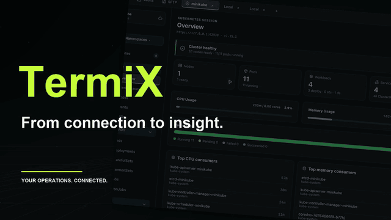

# TermiX

[English](README.md) · [繁體中文](README.zh-Hant.md) · [日本語](README.ja.md)

TermiX brings **SSH, terminal workspaces, SFTP, Kubernetes, and AI troubleshooting** into one operations workspace. A separate mobile app extends host access and cluster operations to your phone.

## Platforms and devices

| Platform | Availability |
| --- | --- |
| macOS | Desktop app with menu bar connection status and updates in supported versions. |
| Windows and Linux | Desktop app; check Releases for available packages. |
| iOS | Mobile preview with SSH, Kubernetes, and host settings import. |
| Android | Not yet available as a supported release. |

## Desktop features

### Hosts and cloud resources

- **Host Vault:** manage hosts, folders, and groups with search, favorites, drag-to-organize, and settings import/export.
- **SSH authentication:** passwords, private keys, passphrases, and SSH certificates. Verify host keys on first connection; mismatched keys are not trusted automatically.
- **Cloud inventory:** import AWS EC2/Lightsail and GCP Compute Engine VMs. See the [GCP guide](docs/GCP-INTEGRATION.md).
- **Mobile settings sync:** export general host settings or use CloudKit in eligible Apple builds. Passwords, private keys, and kubeconfig are excluded.

### Terminals, snippets, and control panel

- **Terminal workspace:** remote SSH and local terminals, multiple tabs, split panes, automatic resizing, and interactive TUI support.
- **Tab organization:** drag tabs together to create split panes. Rename sessions from the context menu or by double-clicking the session name; Enter saves and Esc cancels.
- **Snippets:** save commands, paste or run them in a terminal, assign host startup commands, and run batches on selected hosts.
- **Control panel:** FunctionBox runs common actions; InfoBox displays status. Local FunctionBox commands allow only `open` by default.
- **Logs:** session logs, control-panel logs, and Kubernetes container logs.
- **Preferences:** Traditional Chinese, English, and Japanese; themes, terminal font size, local shell path, and keyboard shortcuts.

### SFTP file transfers

- Browse local and remote files side by side, enter paths, go to the parent directory, refresh, search hosts, and sort by recent connections.
- Upload/download files and folders, select multiple items, drag to upload, create folders, rename items, and delete empty folders.
- Background queues display progress, average speed, and success/failure status. Switching tabs does not interrupt transfers.
- Existing destination files are not overwritten. Resume and recovery across app restarts are not supported. See the [SFTP guide](docs/SFTP.md) for limits.

### Kubernetes workspace

| Feature | Details |
| --- | --- |
| Connections | Read kubeconfig, manage cluster connections, switch Context/Namespace, and configure a custom kubeconfig path. |
| Overview and usage | Cluster overview, Node CPU/memory utilization, and Pod usage. Missing metrics or permissions are shown as unavailable, not zero. |
| Resources | Nodes, Pods, Deployments, StatefulSets, and Workloads, Networking, and Storage categories, with search and detail drawers. |
| Status and events | Pod status filters, issue indicators, related events, and All/Warning/Normal event filters with counts that combine with search. |
| Logs and shell | Container selection, log filtering, pause, download, clear, and Pod Shell. |
| Resource actions | View YAML, edit/create supported resources, delete individual or multiple resources, and scale Deployments/StatefulSets. Masked Pod/Secret YAML cannot be edited and applied directly. |
| Port forwarding | Start, inspect, and stop Pod/Service port forwards. |

Queries and changes require the current cluster's Kubernetes RBAC permissions. Resource status and metrics do not establish external service availability.

### Pod and Event AI analysis

- **Agent connections:** detect, connect, and test local Codex, Claude Code, and Gemini CLI in Settings → AI Connection. Model choices are queried from the agent.
- **Pod analysis:** select containers and Events/Logs scope, then receive a conclusion, root cause analysis, and suggested actions. Expand the evidence actually sent.
- **Event analysis:** analyze events and the current state of related resources from the Event Drawer, without reading logs, Secrets, or full YAML.
- **Follow-up questions:** keep the original analysis and ask further questions with refreshed resource snapshots. Requests can be cancelled; results and conversations are cached during the cluster connection.
- **Cache lifetime:** reanalysis clears that resource's previous result. Leaving or switching clusters, or closing the app, clears the cache.

Install and sign in to an agent CLI first; Codex and Claude Code also require ACP adapters. AI returns diagnostic text and does not execute repairs. Selected logs and events are sent to the agent, whose model service may run remotely; sensitive data written by applications into logs can be included. Gemini is experimental and may be unavailable for some accounts. See the [AI guide](docs/pod-ai-analysis.md) for setup and information about the data used for analysis.

### macOS integration

The menu bar shows SSH connection and active port-forward counts. Inspect hosts, clusters, and ports, disconnect sessions, stop forwards, or return to the main window. Sparkle-enabled releases provide update checks and automatic download settings, with confirmation for active connections and transfers before restarting.

## Install ACP and enable AI analysis

ACP is the protocol TermiX uses to communicate with agent CLIs. **Installing Codex or Claude Code alone is not sufficient: install its ACP adapter as well.** TermiX does not download or install adapters automatically.

1. Have Node.js and npm available, install your chosen agent CLI, and complete its normal sign-in flow. Confirm that your account can use the models you need.
2. Install the adapter for the agent you want; you do not need all of them:

   | Agent | Installation | Executable detected by TermiX |
   | --- | --- | --- |
   | Codex | `npm install -g @agentclientprotocol/codex-acp` | `codex-acp` |
   | Claude Code | `npm install -g @agentclientprotocol/claude-agent-acp` | `claude-agent-acp` |
   | Gemini CLI | Use your existing Gemini CLI; no separate ACP package is needed | `gemini`, launched by TermiX with `--acp` |

3. Make sure globally installed npm executables are accessible to your user. Reopen TermiX after installation, go to **Settings → AI Connection**, and check the detected executable path and status.
4. Connect the agent and use its connection test. The test checks whether TermiX can connect and retrieve the model list; it does not run an analysis. If an adapter is missing, check the installation and executable discovery. Resolve sign-in or account permission errors in the CLI.
5. Open **Kubernetes → Pods/Events → resource Drawer → AI Analysis**. Select a connected agent and a model from its live list. For Pods, also choose the container and Events/Logs scope, then start analysis. Ask follow-up questions in the same panel when it finishes.

You do not need to keep an ACP process running manually in a terminal; TermiX manages its sessions. A successful connection test does not guarantee inference access or available quota for every model. Analysis uses your selected agent's model service. Gemini support is experimental. See the [AI guide](docs/pod-ai-analysis.md) for data boundaries and compatibility details.

## Mobile app and cross-device use

The mobile app provides the following features:

| Feature | Current mobile capabilities |
| --- | --- |
| Hosts | Hosts and folders, password/private-key authentication, and device-secured credential storage. |
| SSH terminal | Real SSH/PTY, host fingerprint confirmation, shortcuts, saved commands, touch controls, and secret input. One session at a time; entering the background disconnects it. |
| Kubernetes | Import kubeconfig, switch clusters and namespaces, browse resource categories and health, search, and filter issues. |
| Logs and usage | Pod container logs, CPU/memory usage and limits, with separate states for no limits, missing samples, and incomplete data. |
| Resource actions | YAML/image updates and deletion for supported resources, plus Deployment/StatefulSet scaling. Some resources offer only summaries and read-only YAML; Secret data is masked. |
| AWS EKS | Manage AWS profiles, temporary credentials, and AssumeRole. Supports standard EKS authentication, without executing arbitrary kubeconfig exec commands. |
| Appearance and language | Appearance settings and Traditional Chinese, English, and Japanese. |

**Desktop-to-mobile host settings sync** offers two methods:

1. **File import:** export from the desktop's More → Mobile Sync, then import in the phone's Settings → Sync Settings. Import again after settings change.
2. **CloudKit:** requires the same Apple ID and an app version that offers iCloud sync. Keep both apps open to sync every 30 seconds. If the iCloud option is unavailable, use file import.

Only general host fields and folders are transferred. Passwords, private keys, trusted host keys, snippets, and kubeconfig are excluded; configure authentication separately on the phone. Windows/Linux desktops provide file export; Android has no CloudKit. See the [mobile guide](apps/mobile/README.md) and [sync guide](apps/mobile/SYNC.md).

## Requirements

- macOS 11+, Windows 10+, or a mainstream Linux distribution.
- Optional Kubernetes features require valid kubeconfig and cluster access.
- AI features additionally require Node.js/npm, a signed-in agent CLI, and the appropriate ACP adapter.

## Download and install

Download your platform's package from [Releases](https://github.com/jie0214/TermiX/releases).

### macOS

1. Open `TermiX-<version>-macos.dmg` (older releases provide ZIP files).
2. Drag `TermiX.app` into Applications and open it.
3. Sparkle-enabled versions offer “Check for Updates” and automatic download preferences. Active connections are checked before restarting. Older versions require one manual installation first.

### Windows

1. Extract `TermiX-<version>-windows-amd64.zip` and run `TermiX.exe`.
2. If SmartScreen appears, verify the source before choosing “More info” → “Run anyway”.

### Linux

1. Extract `TermiX-<version>-linux-amd64.tar.gz`.
2. Run `chmod +x TermiX && ./TermiX`.

If Releases has no package for your platform, a supported installer is not currently available there.

## Quick start

1. Add an SSH host and choose password, key, or certificate authentication.
2. Connect and open terminal tabs or split panes; local terminals are also available.
3. Use FunctionBox actions and InfoBox status displays in the control panel.
4. Open SFTP, connect to a saved host, and transfer files with the dual-pane view or drag-and-drop.
5. Provide kubeconfig, select a cluster and namespace, and inspect resources, events, and usage.
6. Configure an agent using the [AI guide](docs/pod-ai-analysis.md), open AI Analysis in a Pod/Event Drawer, select a model and evidence scope, then analyze and ask follow-up questions.
7. If you have access to the mobile preview, import host settings and configure phone credentials separately.

## Advanced settings

- `TERMIX_ALLOW_UNSAFE_LOCAL_COMMANDS=1`: permits arbitrary local shell commands in FunctionBox instead of only `open`. Enable only for trusted command sources.

## FAQ

- **Missing Kubernetes data or access errors:** check cluster permissions and Metrics availability.
- **Security warning on launch:** confirm the official download source and version. Older macOS and unsigned Windows packages can show warnings; report the version and full error if a signed macOS release is rejected.
- **FunctionBox rejects commands:** local commands are restricted by default; see Advanced settings.

## License

[MIT License](LICENSE). Bundled third-party packages retain their original licenses (MIT/BSD/Apache-2.0).
