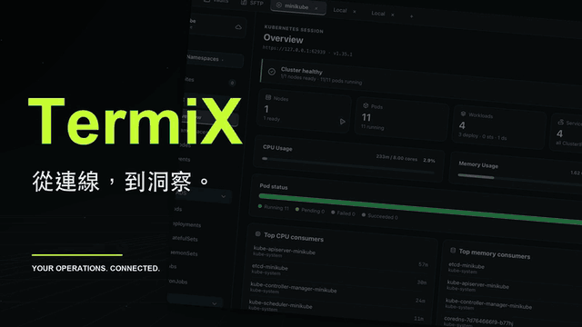

# TermiX

[English](README.md) · [繁體中文](README.zh-Hant.md) · [日本語](README.ja.md)

TermiX 將 **SSH、終端工作區、SFTP、Kubernetes 與 AI 異常分析**整合在同一個維運工作區，並提供獨立手機版，讓主機連線與叢集操作延伸到行動裝置。

## 平台與裝置

| 平台 | 提供狀態 |
| --- | --- |
| macOS | 桌面版，提供選單列連線狀態；支援版本可在 App 內更新。 |
| Windows、Linux | 桌面版；可下載的安裝包請查看 Releases。 |
| iOS | 手機預覽版，包含 SSH、Kubernetes 與主機設定匯入。 |
| Android | 尚未提供正式支援版本。 |

## 桌面功能

### 主機與雲端資源

- **主機保險箱**：集中管理主機、資料夾與群組，支援搜尋、收藏、拖曳整理，以及設定匯入／匯出。
- **SSH 登入**：密碼、私鑰、私鑰密語及 SSH Certificate；首次連線核對主機金鑰，不自動信任不相符的金鑰。
- **雲端主機匯入**：AWS EC2／Lightsail，以及 GCP Compute Engine VM；GCP 設定見[整合指南](docs/GCP-INTEGRATION.md)。
- **手機設定同步**：匯出一般主機資料至手機，或在符合條件的 Apple 建置使用 CloudKit；不包含密碼、私鑰或 kubeconfig。

### 終端、常用指令與控制面板

- **終端工作區**：遠端 SSH 與本機終端、多分頁、分割窗格、自動尺寸調整及互動式 TUI。
- **分頁整理**：拖曳分頁合併為分割窗格；以右鍵選單或雙擊 Session 名稱重新命名，Enter 儲存、Esc 取消。
- **常用指令**：保存 Snippet、貼入或執行於終端、綁定主機啟動指令，以及向指定主機批次執行。
- **控制面板**：FunctionBox 執行常用動作，InfoBox 顯示狀態；FunctionBox 本機指令預設僅允許 `open`。
- **日誌**：Session 日誌、控制面板日誌，以及 Kubernetes 容器日誌。
- **個人設定**：繁體中文、English、日本語，多種外觀主題、終端字級、本機 Shell 路徑與快捷鍵設定。

### SFTP 檔案傳輸

- 本機／遠端雙欄瀏覽，支援路徑輸入、上一層、重新整理、主機搜尋與最近連線排序。
- 上傳／下載檔案及資料夾、多選、拖放上傳、建立資料夾、重新命名及刪除空資料夾。
- 背景傳輸佇列顯示進度、平均速度與完成／失敗狀態；切換頁籤不會中斷傳輸。
- 不覆寫同名目的檔案，不提供續傳或跨重啟恢復；完整限制見 [SFTP 指南](docs/SFTP.md)。

### Kubernetes 叢集工作區

| 功能 | 內容 |
| --- | --- |
| 連線與導覽 | 讀取 kubeconfig，管理叢集連線，切換 Context／Namespace；可自訂 kubeconfig 路徑。 |
| 概覽與用量 | Overview、Node CPU／記憶體使用率、Pod 資源用量；缺少 Metrics 或查詢權限時明確顯示缺值。 |
| 資源瀏覽 | Nodes、Pods、Deployments、StatefulSets，以及 Workloads、Networking、Storage 等資源分類；提供搜尋與詳細資料 Drawer。 |
| 狀態與事件 | Pod 狀態篩選、異常標示、Related Events；Events 提供 All／Warning／Normal 按鈕、筆數及搜尋交集。 |
| 日誌與 Shell | 選取容器查看日誌，支援篩選、暫停、下載、清除，以及 Pod Shell。 |
| 資源操作 | YAML 檢視、支援資源的編輯與建立、單筆／多選刪除，以及 Deployment／StatefulSet 副本調整。Pod／Secret 的遮蔽 YAML 不可直接編輯套用。 |
| 連接埠轉發 | Pod／Service Port Forward，查看與停止轉發。 |

所有查詢及變更均受目前叢集的 Kubernetes RBAC 權限限制；資源狀態與 Metrics 採樣不代表外部服務可用性。

### Pod 與 Event AI 分析

- **Agent 連線**：在 Settings → AI Connection 偵測、連結及測試本機 Codex、Claude Code、Gemini CLI；模型選單向 Agent 即時查詢。
- **Pod 分析**：選擇容器及 Events／Logs 範圍，取得「結論、根因分析、建議處理」，可展開實際送出的證據。
- **Event 分析**：從 Event Drawer 分析事件與關聯資源的目前狀態；不讀取日誌、Secret 或完整 YAML。
- **接續提問**：保留原分析並追問，每次附上更新的資源快照；可取消分析，結果與對話在目前叢集連線期間暫存。
- **暫存範圍**：重新分析會清除該資源原結果；退出或切換叢集、關閉 App 後不保留。

需先安裝並登入 Agent CLI；Codex 與 Claude Code 另需 ACP 轉接程式。AI 僅提供診斷文字，不自動執行修復。選取的日誌與事件會送交 Agent，其模型服務可在遠端執行；應用程式自行寫入日誌的敏感內容仍會包含在選取資料內。Gemini 為實驗性支援，部分帳號無法使用。安裝步驟及分析使用的資料範圍見 [AI 分析指南](docs/pod-ai-analysis.md)。

### macOS 整合

選單列顯示 SSH 連線及執行中的 Port Forward 數量；可查看主機、叢集與轉發連接埠，直接中斷連線、停止轉發或返回主視窗。支援 Sparkle 的發佈版本提供更新檢查與自動下載設定，重啟前確認使用中的連線及傳輸。

## 安裝 ACP 並啟用 AI 分析

ACP 是 TermiX 與 Agent CLI 通訊的協定。**只安裝 Codex 或 Claude Code 本體還不夠，需另裝對應的 ACP 轉接程式**；TermiX 不會自動下載或安裝。

1. 準備 Node.js 與 npm，並先安裝要使用的 Agent CLI。在該 CLI 依既有方式完成登入，確認帳號可使用所需模型。
2. 依所選 Agent 安裝對應轉接程式，無須全部安裝：

   | Agent | 安裝指令 | TermiX 偵測的執行檔 |
   | --- | --- | --- |
   | Codex | `npm install -g @agentclientprotocol/codex-acp` | `codex-acp` |
   | Claude Code | `npm install -g @agentclientprotocol/claude-agent-acp` | `claude-agent-acp` |
   | Gemini CLI | 使用既有 Gemini CLI，不需額外 ACP 套件 | `gemini`，由 TermiX 加上 `--acp` 啟動 |

3. 確認全域 npm 執行檔可供目前使用者存取；安裝完成後重新開啟 TermiX，進入 **Settings → AI Connection**，確認 Agent 的執行檔位置與狀態。
4. 按下該 Agent 的連線及測試連線按鈕。測試會確認連線與模型清單，不會執行分析。如果提示缺少轉接程式，先確認第 2 步安裝成功且執行檔可被找到；登入或權限錯誤則回到 CLI 處理。
5. 開啟 **Kubernetes → Pods／Events → 資源 Drawer → AI Analysis**，選擇已連線的 Agent 與即時模型清單中的模型；Pod 可再選擇容器及 Events／Logs 範圍，然後開始分析。完成後可在同一面板接續提問。

不必手動在終端常駐啟動 ACP 程序，TermiX 會管理其工作階段。測試連線成功不保證帳號有每個模型的推論權限或足夠配額；實際分析會使用所選 Agent 的模型服務。Gemini 為實驗性支援。更多資料邊界與相容性說明見 [AI 分析指南](docs/pod-ai-analysis.md)。

## 手機版與跨裝置

手機版提供以下功能：

| 功能 | 手機版目前內容 |
| --- | --- |
| 主機管理 | 主機與資料夾、密碼或私鑰登入設定；憑證使用裝置安全儲存。 |
| SSH 終端 | 真實 SSH／PTY、主機指紋確認、快捷鍵、常用指令、觸控操作與機密輸入；一次一個 Session，進入背景會中斷。 |
| Kubernetes | 匯入 kubeconfig、切換叢集及 Namespace、資源分類、健康狀態、搜尋與異常篩選。 |
| 日誌與用量 | Pod 容器日誌、CPU／記憶體用量與上限；無上限、無採樣或資料不完整會分開呈現。 |
| 資源操作 | 支援資源的 YAML／映像更新、刪除，以及 Deployment／StatefulSet 副本調整；部分資源只提供摘要與唯讀 YAML，Secret 資料遮蔽。 |
| AWS EKS | 手機管理 AWS profiles、暫時憑證與 AssumeRole；支援標準 EKS 驗證，不執行任意 kubeconfig exec。 |
| 外觀與語言 | 外觀設定，以及繁體中文、English、日本語。 |

**桌面至手機的主機設定同步**有兩種方式：

1. **檔案匯入**：桌面「更多 → 手機同步」匯出，手機「設定 → 同步設定」選檔匯入；設定更新後需重新匯入。
2. **CloudKit**：需使用相同 Apple ID，以及提供 iCloud 同步選項的 App 版本。兩端 App 開啟時每 30 秒同步；若沒有 iCloud 選項，請使用檔案匯入。

只傳送一般主機欄位與資料夾，不同步密碼、私鑰、主機金鑰、常用指令或 kubeconfig。手機須自行設定驗證資料。Windows／Linux 桌面提供檔案匯出；Android 不提供 CloudKit。詳見[手機版文件](apps/mobile/README.md)與[同步指南](apps/mobile/SYNC.md)。

---

## 系統需求

- **作業系統**：macOS 11 以上、Windows 10 以上，或主流 Linux 發行版。
- **Kubernetes 功能（選用）**：需要一份有效的 `~/.kube/config` 與對應叢集的存取權限。
- AI 功能另需 Node.js／npm、已登入的 Agent CLI 與對應 ACP 轉接程式。

---

## 下載與安裝

到本專案的 [Releases](https://github.com/jie0214/TermiX/releases) 頁面下載對應作業系統的檔案：

### macOS
1. 下載 `TermiX-<版本>-macos.dmg` 並開啟磁碟映像（舊版 Release 提供 ZIP）。
2. 將 `TermiX.app` 拖入「應用程式」資料夾。
3. 開啟 `TermiX.app`。支援 Sparkle 的新版可從「Check for Updates」檢查更新，並在「更新設定…」開啟自動下載。更新重啟前會確認使用中的連線。舊版請先手動安裝一次。

### Windows
1. 下載 `TermiX-<版本>-windows-amd64.zip`，解壓縮後執行 `TermiX.exe`。
2. 若出現 SmartScreen 提示，點「更多資訊」→「仍要執行」。

### Linux
1. 下載 `TermiX-<版本>-linux-amd64.tar.gz` 並解壓縮。
2. 加上執行權限後執行：`chmod +x TermiX && ./TermiX`。

若 Releases 沒有對應平台的安裝包，表示該處目前尚未提供該平台的正式安裝版本。

---

## 快速上手

1. **新增主機**：開啟後在「主機保險箱」新增 SSH 主機，填入位址與登入方式（密碼 / Key / Certificate），即可連線。
2. **使用終端**：連線後進入終端工作區，可開多個分頁與窗格；也可開本機終端機。
3. **控制面板**：用 FunctionBox 執行預設動作、InfoBox 觀察狀態。
4. **傳輸檔案**：開啟 SFTP、選取已保存的主機並連線，以雙欄瀏覽或拖放上傳。
5. **操作 Kubernetes**：準備 kubeconfig，開啟 Kubernetes、選擇叢集與 Namespace，查看資源、事件及用量。
6. **分析異常**：先依 [AI 指南](docs/pod-ai-analysis.md)完成 Agent 設定，再從 Pod／Event Drawer 開啟 AI Analysis，選取模型與證據範圍；完成後可接續提問。
7. **使用手機**：若已取得手機預覽版，可匯入一般主機設定，再於手機設定登入憑證。

---

## 進階設定（環境變數）

一般使用不需要設定，以下為選用：

- `TERMIX_ALLOW_UNSAFE_LOCAL_COMMANDS=1`
  預設 FunctionBox 只允許執行 `open`。設定此變數後才能執行任意本機 Shell 指令，**請確認來源可信任再啟用**。

---

## 常見問題

- **Kubernetes 資源顯示存取失敗或缺值**：多半是 `~/.kube/config` 權限不足，或叢集未提供 Metrics；請確認你的帳號對該叢集有對應權限。
- **開啟時出現安全警告**：先確認檔案來自官方 Release；舊版 macOS 或尚未簽章的 Windows 套件仍會出現警告。正式簽署的 macOS 版本若遭系統拒絕，請回報版本與完整錯誤訊息。
- **FunctionBox 無法執行某些指令**：這是安全預設；如確需執行本機指令，請參考上方環境變數。

---

## 授權

本專案採用 [MIT License](LICENSE)，可自由使用、修改與散布。所含第三方套件各自保留其原授權（MIT / BSD / Apache-2.0）。
